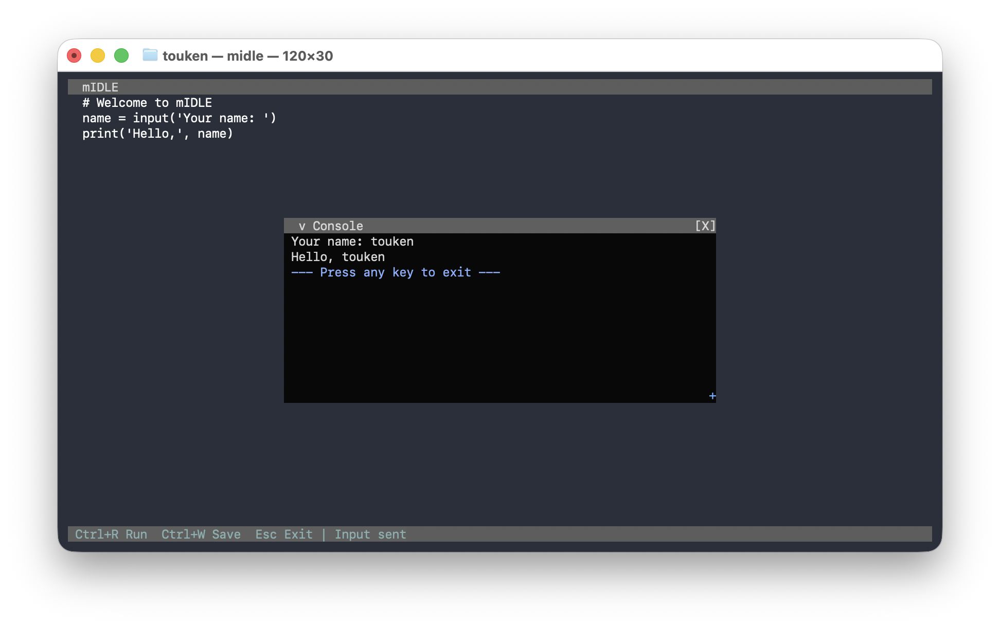

<h1 align="center">mIDLE</h1>

<p align="center">
  <strong>A terminal IDE for Python, JavaScript, and Lua with embedded runtimes and an ImTUI interface.</strong>
</p>

<p align="center">
  <a href="https://en.cppreference.com/w/cpp/17"></a>
  <a href="https://cmake.org/"></a>
  <a href="https://github.com/touken928/mIDLE/actions/workflows/ci.yml"></a>
  <a href="https://github.com/touken928/mIDLE/stargazers"></a>
</p>

<p align="center">
  
</p>

Write and run Python, JavaScript, or Lua directly in your terminal. Python uses embedded MicroPython; JavaScript uses QuickJS; Lua uses upstream PUC-Rio Lua — no system interpreters required.

## Features

- **Full-screen editor** — write scripts in a native TUI text editor with cursor, mouse, and scroll
- **Syntax highlighting** — Python, JavaScript, and Lua keywords, strings, comments, and more
- **Built-in console** — run code and see output in a floating popup
- **Interactive input** — Python `input()` and JavaScript `prompt()` are wired to the console stdin field
- **Keyboard interrupt** — stop runaway code with `Ctrl+R`
- **Multi-language** — open `.py` / `.js` / `.lua` files or pick a language with `--py` / `--js` / `--lua`
- **Dark theme** — solid, readable colors tuned for the terminal

## Quick start

Download a prebuilt binary from [Releases](https://github.com/touken928/mIDLE/releases), or build from source:

```bash
git clone https://github.com/touken928/mIDLE.git
cd mIDLE
git submodule update --init
git submodule update --init --recursive third_party/imtui
cmake --preset default
cmake --build --preset default -j
./build/midle
```

Do **not** use `git clone --recurse-submodules`: the MicroPython submodule has many nested submodules that are not needed and may fail to fetch. Initialize only `imtui` recursively (and `pdcurses` on Windows cross-builds).

Requires CMake ≥ 3.16, a C++17 compiler, ncurses, and python3 (for MicroPython header generation at configure time).

## Usage

```bash
./build/midle                    # open the default sample (Python)
./build/midle script.py          # open a Python file
./build/midle script.js          # open a JavaScript file
./build/midle script.lua         # open a Lua file
./build/midle --js               # start in JavaScript mode (default sample)
./build/midle --lua              # start in Lua mode (default sample)
./build/midle --py script.js     # force Python mode for a .js file
./build/midle --run script.py    # run a script and print output, then exit
```

Language is chosen from the file extension (`.py`, `.pyw`, `.js`, `.mjs`, `.lua`) unless `--py`, `--js`, or `--lua` is given. Default is Python.

`Ctrl+S` saves only when mIDLE was started with a file path.

| Key | Action |
|-----|--------|
| `Ctrl+R` | Run / Stop |
| `Ctrl+S` | Save (when a file was opened) |
| `Esc` | Exit |
| `Tab` | Indent |

### Language I/O

| Language | Output | Input |
|----------|--------|-------|
| Python | `print(...)` | `input('prompt')` |
| JavaScript | `print(...)` | `prompt('prompt')` |
| Lua | `print(...)` | `prompt('prompt')` |

JavaScript and Lua use host-provided `print` / `prompt` globals — not `console.log`, Node.js, or `io.read()`.

## Development

Run tests after building with the `with-tests` preset:

```bash
cmake --preset with-tests
cmake --build --preset with-tests -j
ctest --preset default
```

See [AGENTS.md](AGENTS.md) for architecture, build gotchas, and how to add a new language backend.
